# consultas1_sql

#CONSULTAS SQL

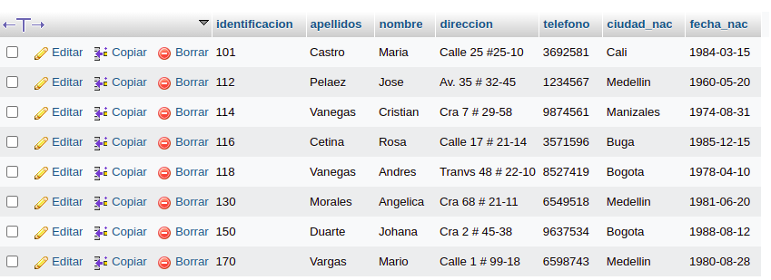

1. Para visualizar toda la informacion que contiene la tabla `usuario` se puede incluir con la inclusion SELCET el caracter "*" o cada uno de los campos de la tabla
`select * from usuario`

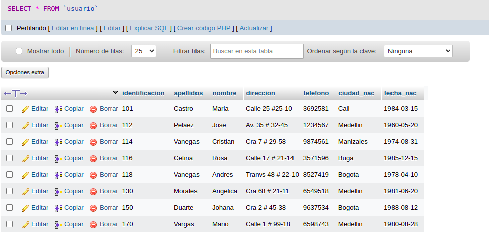

2. Visualizar solamente la identificacion del usuario.

`select Identification from usuario`

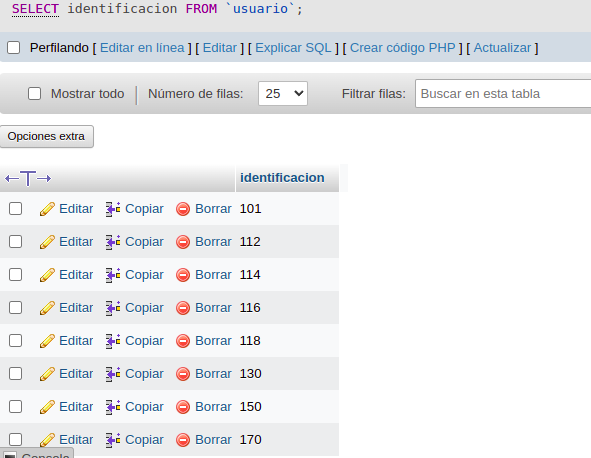

3. Se desea obtener los registros cuya identidad sea mayores o iguales a 150, se utiliza la clausula where que especifica los condiciones que deben reunir los registros que se vam a seleccionar.

`SELECT * FROM usuario WHERE identification>='150'`

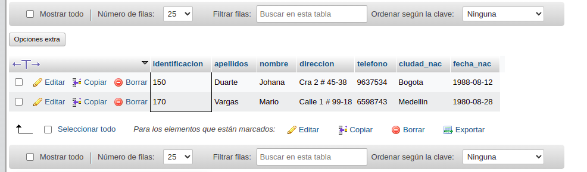

4. si se desea obtener los registros cuyos apellidos sean vanegas o cetinas se debe utilizar el operador in que especifica los registros que se quieren visualizar de una tabla.

`SELECT apellidos FROM usuario WHERE apellidos IN ('vanegas', 'cetina')`

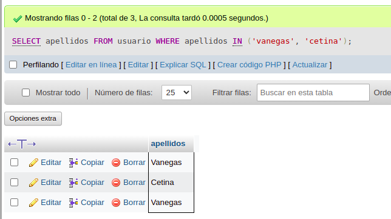

O se puede utilizar el operador OR

`SELECT apellidos FROM usuario WHERE apellidos='vanegas' OR apellidos='cetina'`

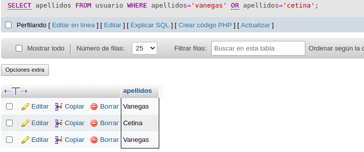

5. si se desea obtener los registros cuya identificacion sea menor que 110 y la ciudad sea cali se debe utilizar el operadir and.

`SELECT * FROM usuario WHERE identificacion<150 AND ciudad_nac='Cali'`

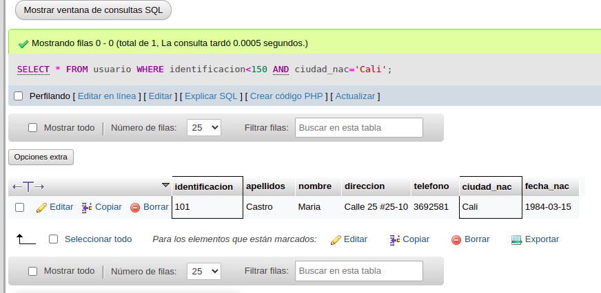

6. si se desea obener los registros cuyos nombres empiecen por la letra a se debe utilizar el operador LIKE que utiliza los patrones "%" (todos) y '_' (caracter).

`SELECT * FROM usuario WHERE nombres LIKE '%A%'`

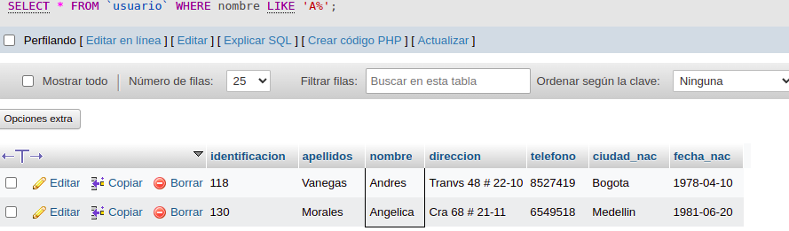

7. si se desea obtener los registros cuyos nombres contengan la letra 'a'.

`SELECT * FROM usuario WHERE nombre like 'a%'`

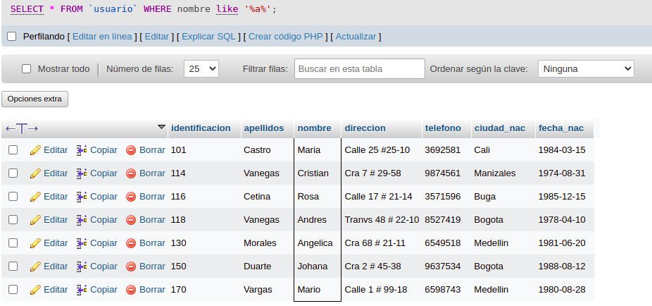

8. si se desea obtener los registros donde la cuarta letra del nombre sea una 'a'.
`SELECT * FROM usuario WHERE nombre LIKE '___a'`

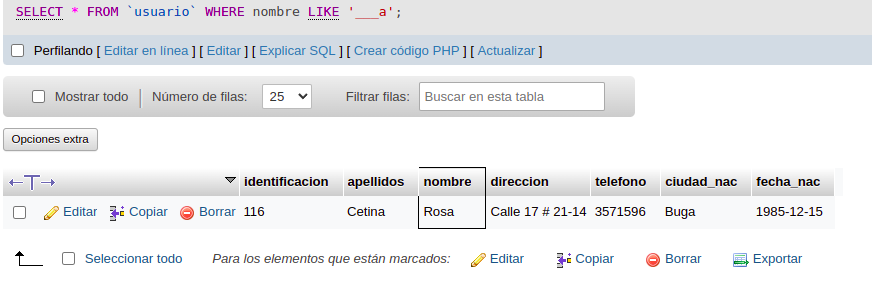

9. si se desea obtener los registros cuya identificacion este entre el inte clausula BETWEEN, que sirve para identificar un intervalo de valores

`SELECT * FROM `usuario` WHERE identificacion BETWEEN '110' AND '150'`

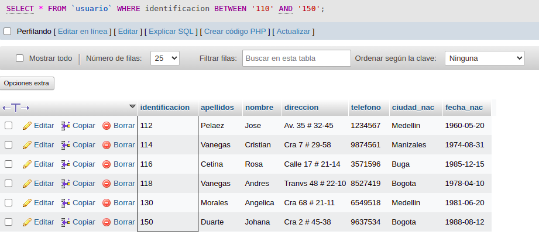

## COMANDO DELTE

10. Para eliminar solamente los registros cuya identificacion sea mayor de 130

`DELETE FROM `usuario` WHERE identificacion>130`

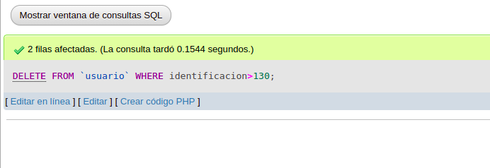

## INNER JOIN

Permite obtener datos de dos o mas tablas. Cuando se realiza la concatacion de las tablas, no necesariamente se debe mostrar todo los datos

## TABLA PEDIDOS

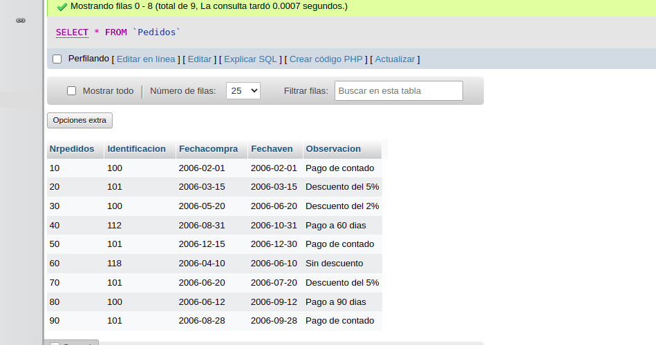

12. Para visualizar los campos identificació, nombre, apellidos de la tabla usuario y nropedido, fecha de comprar, decha de vecimiento y observación se debe realizar la siguiente instruccion SQL:

SELECT usuario.Identificación usuario.nombre, usuario.apellidos, pedido.nropedido, pedido.fechacompra, pedido.fechavence, pedidos.observacion FROM usuario INNER JOIN Pedidos ON usuario.Identificación = pedidos.Identificación

13. Para visualizar todos los campos de las tablas usuarios y pdeidos donde identificacion sea mayor que 100 se dbe realizar la siguiente instruccion:

`SELECT usuarios.* Pedidos.* FROM usuarios INNER JOIN Pedidos ON usuarios.identificacion = Pedidos.identificacion WHERE usuarios.identificacion>100`

